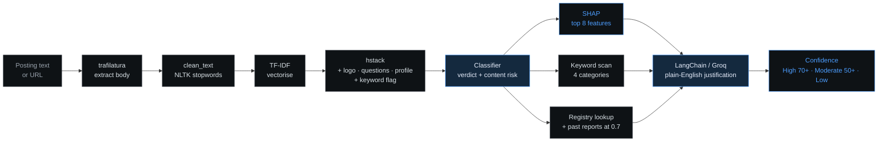

<!-- ============ MASTHEAD / NAMEPLATE / TERMINAL ============ -->
<div align="center"></div>

<!--
  ALTERNATIVE MASTHEADS - pulled from the stack, assets still in the repo.

  The severed bust, three pieces adrift:
  

  The neurons clip, kept from the earlier version.

  With the name burned into the frames:
  

  Clean, no text:
  
-->

<p align="center">
  
</p>

<p align="center">
  
  &nbsp;
  
  &nbsp;
  
  &nbsp;
  
</p>


<!-- ============ ABOUT ============ -->
## 🎯 About Me

```typescript
const aryan = {
    name:     "Aryan Nagar",
    focus:    "Explainable ML and agentic AI systems",
    study:    "B.Tech CSE '27 @ GIT Jaipur (RTU)",
    location: "Jaipur, Rajasthan, India 🇮🇳",

    shipped: [
        "FraudLens - explainable scam detection, 7x fraud-rate lift",
        "Kuberis   - AI business intelligence agent"
    ],

    experience: "Agentic AI Intern @ Grras Solutions, May-Jul 2026",

    learning: [
        "Advanced Learning Algorithms",
        "Unsupervised Learning, Recommenders, Reinforcement Learning"
    ],

    stack: {
        ml:      ["PyTorch", "Scikit-learn", "XGBoost", "SHAP"],
        agentic: ["LangChain", "Groq", "Gemini API"],
        data:    ["Pandas", "NumPy", "Matplotlib", "Seaborn", "NLTK"],
        backend: ["FastAPI", "REST"]
    },

    openTo: "Internship - ML Engineering / Data Science / Agentic AI"
};
```

<br>


<!-- ============ TECH ============ -->
## 🛠️ Tech Arsenal

<table align="center" width="100%">
<tr>

<td width="50%" align="center">

<h3>🤖 Machine Learning &amp; AI</h3>

<br>


<br>


<br><br>

<h3>💻 Programming Languages</h3>

<br>


</td>

<td width="50%" align="center">

<h3>⚙️ Backend &amp; APIs</h3>

<br>


<br>


<br><br>

<h3>📊 Data Analysis &amp; Visualisation</h3>


<br>


</td>

</tr>
</table>

<h3 align="center">🧰 Tools, Platforms &amp; Cloud</h3>
<p align="center">
  
</p>
<p align="center">
  
  
  
  
</p>


<!-- ============ CONNECT ============ -->
## 🌐 Connect With Me

<p align="center">
  <a href="https://www.linkedin.com/in/aryan-nagar-aa870a290/"></a>
  &nbsp;
  <a href="mailto:nagar.aaryan04@gmail.com"></a>
  &nbsp;
  <a href="https://www.instagram.com/t0o.dangerous.aary/"></a>
</p>


<!-- ============ PROJECTS ============ -->
## ⭐ Featured Projects

<table align="center">
<tr>

<td width="50%" align="center">
  <a href="https://github.com/WnagarAryan/FraudLens-Project-Showcase">
    </a>
  <br><br>
  <sub>Explainable ML for job-scam detection. Benchmarked 5 algorithms with SMOTE over 17,880
  postings and selected LinearSVC on Fake-class F1; SHAP plus a LangChain/Groq layer explains
  every verdict in plain English, backed by live company verification.
  <b>7&times; fraud-rate lift - 34.2% against a 4.8% baseline.</b></sub>
  <br><br>
  <a href="https://fraudlens-project-showcase.onrender.com"></a>
  <a href="https://github.com/WnagarAryan/FraudLens-Project-Showcase"></a>
</td>

<td width="50%" align="center">
  <a href="https://github.com/WnagarAryan/Kuberis">
    </a>
  <br><br>
  <sub>Auto-classifies any uploaded CSV or Excel file and computes 10+ KPIs, then answers 8+
  types of natural-language question through an insights engine on Groq Llama 3.3 70B.
  FastAPI backend, custom JS frontend - no dashboard framework boilerplate.</sub>
  <br><br>
  <a href="https://kuberis-ai-business-intelligence-agent.onrender.com/"></a>
  <a href="https://github.com/WnagarAryan/Kuberis"></a>
</td>

</tr>
</table>

<h3 align="center">How FraudLens works</h3>



<h3 align="center">How Kuberis works</h3>




<!-- ============ ANALYTICS ============ -->

```mermaid
flowchart LR
    A["CSV / XLSX"] --> B["load · validate · classify<br/>Sales · Financial · BI"]
    B --> C["calculate_business_metrics<br/>7 KPIs, where a column matches"]
    C --> S{"generate_initial_insights"}

    S -->|"model answers"| SA["DatasetSummary<br/>via Groq"]
    S -->|"3 attempts fail"| SB["summarize_without_llm<br/>Pandas-only summary"]

    SA --> D["Dashboard<br/>metrics · preview · statistics"]
    SB --> D

    D --> Q["Question in<br/>plain English"]
    Q --> X["detect_intent · execute_analysis<br/>9 routed types, computed in Pandas"]
    X --> E["explain_result<br/>answer · explanation · recommendation"]

    style A  fill:#e4ddcf,color:#14293e,stroke:#a9832f
    style B  fill:#e4ddcf,color:#14293e,stroke:#a9832f
    style C  fill:#e4ddcf,color:#14293e,stroke:#a9832f
    style S  fill:#14293e,color:#e4ddcf,stroke:#a9832f
    style SA fill:#14293e,color:#e4ddcf,stroke:#a9832f
    style SB fill:#e4ddcf,color:#14293e,stroke:#8c8474
    style D  fill:#e4ddcf,color:#14293e,stroke:#a9832f
    style Q  fill:#e4ddcf,color:#14293e,stroke:#a9832f
    style X  fill:#e4ddcf,color:#14293e,stroke:#a9832f
    style E  fill:#14293e,color:#e4ddcf,stroke:#a9832f
```

## 📊 GitHub Analytics

<p align="center">
  
  
</p>

<p align="center">
  
</p>

<p align="center">
  
</p>

<p align="center">
  
  
</p>

<p align="center">
  
  
</p>

<!--
  TROPHIES and ACTIVITY GRAPH - both disabled.

  github-profile-trophy.vercel.app and github-readme-activity-graph.vercel.app
  are each returning HTTP 402 for every user, not just this one: their Vercel
  deployments are over quota, so both sections rendered as broken images.
  The Pac-Man and snake graphs below cover the same ground and are generated by
  our own Actions, so nothing here depends on somebody else's free tier.

  Uncomment either block if the service comes back, or point it at your own fork.

## 🏆 Trophies

<p align="center">
  <a href="https://github.com/WnagarAryan">
    
  </a>
</p>

## 📈 Contribution Graph

<p align="center">
  
</p>
-->

<!-- ============ GAME 1: PAC-MAN ============ -->
## ⌘ Commit Activity - Pac-Man

<p align="center">
  <picture>
    <source media="(prefers-color-scheme: dark)"  srcset="https://raw.githubusercontent.com/WnagarAryan/WnagarAryan/output-pacman/pacman-contribution-graph-dark.svg">
    <source media="(prefers-color-scheme: light)" srcset="https://raw.githubusercontent.com/WnagarAryan/WnagarAryan/output-pacman/pacman-contribution-graph.svg">
    
  </picture>
</p>

<!-- ============ GAME 2: SNAKE ============ -->
## 🐍 Contribution Snake

<p align="center">
  <picture>
    <source media="(prefers-color-scheme: dark)"  srcset="https://raw.githubusercontent.com/WnagarAryan/WnagarAryan/output/github-contribution-grid-snake-dark.svg">
    <source media="(prefers-color-scheme: light)" srcset="https://raw.githubusercontent.com/WnagarAryan/WnagarAryan/output/github-contribution-grid-snake.svg">
    
  </picture>
</p>


<!-- ============ QUOTE + FOOTER ============ -->
<p align="center">
  
</p>
