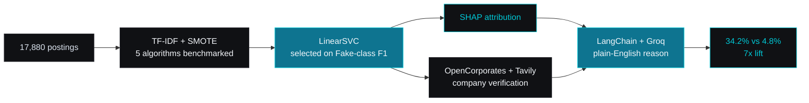

I build explainable ML and agentic AI systems. Models that can justify the call
they just made, and agents that carry a task from prompt to finished work.

Open to ML, data science and agentic AI internships.

## FraudLens

Explainable ML for job-scam detection. 2026.

Trained on 17,880 postings. Five algorithms benchmarked with SMOTE, and
LinearSVC selected on Fake-class F1 rather than accuracy, because a false
positive costs a real person a real opportunity. SHAP explains each call. A
LangChain and Groq layer turns that attribution into a readable sentence. Live
company verification runs against OpenCorporates and Tavily before the verdict
is shown.

Result: a 34.2% fraud rate in flagged listings against a 4.8% base rate. A 7x
lift.

## Kuberis

AI business-intelligence agent. 2026.

Upload a spreadsheet, get KPIs, then ask questions in English. A Pandas pipeline
classifies any CSV or Excel file and computes 10 or more KPIs without being told
the schema. The insights engine runs on LangChain and Groq's Llama 3.3 70B and
handles 8 or more categories of natural-language query.

Pandas calculates every figure. The model only describes the result, so a
business number is never something the model invented. FastAPI, custom JS
frontend, deployed on Render.
